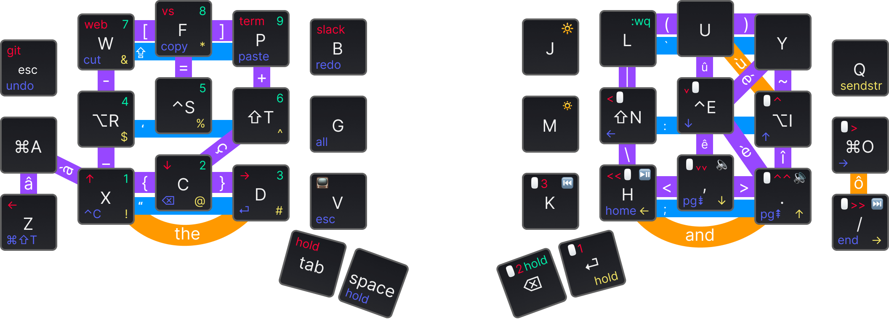

# xavv1 – 34 keys hybrid Layout & Combo

## Keymap

_Figma layout made thanks to [@madhanparthasar](https://www.figma.com/@madhanparthasar)'s [Ortholinear Keyboard Keybinding Layout Tool
](https://www.figma.com/community/file/1283154322826272613)_ 🙌



## Origins

This layout is organic and keeps evolving based on:

- real needs: reduce hand gestures, reduce frequently used keystrokes, etc.
- exploration need: custom keebs offer a brand new experience and I love to explore what is possible out there

It's not a surprise that this keymap is a hybrid. It was inspired by 2 opposite approaches:

- [Miryoku](https://github.com/manna-harbour/miryoku) – a full-layer COLMAK-DH keymap, that has excellent [principles](https://github.com/manna-harbour/miryoku/tree/master/docs/reference#general-principles):
  - Use layers instead of reaching.
  - Use both hands instead of contortions.
  - Use the home positions as much as possible.
  - Make full use of the thumbs.
  - Avoid unnecessary complications.
- [Kombol](https://github.com/skychil/kombol) – a combo-optimized keymapping. This extends Miryoku and removes some confusion for keys like `[]`, `{}`, `()`, `-=+`, `' "`, `; :`, ... that I had some hard time mastering with Miryoku.

The QMK code is inspired by the [sweep_keymap from flinguenheld](https://github.com/flinguenheld/sweep_keymap).

### Tap Dance

#### Apps shortcuts doubled with long-tap

You'll find some tap-dance actions on the `_MOUSE` layer. For example: `TD(TD_BROWSER)`.
This allows the keyboard to respond to 2 different events: normal tap and long tap (down until the tapping term, then up).

I use that for:

- Browser: short tap is working/codding (Chrome) / long tap is personal browser (Brave).
- GitHub App / Figma App: as Figma is less used, it is mapped to the long tap.
- Rectangle (windows management for Mac): a normal tap moves the windows on another screen and a long tap makes the window full-screen.

See `features/tap_dance.c` for the implementation.

### Refinements

- `#define QUICK_TAP_TERM 0` disable the `QUICK_TAP_TERM`.
  This allows double-tapping a modifier key (and holding it on the second tap) and getting the hold action triggered.
  In the context of this keyboard, a simple example is
  "you tipped a wrong number, correct it with `tap BCKSP` then `hold BCKSP` (NUM LAYER) then your number.
  The double `BACKSP` requires activating the layer, not to switch to `QUICK_TAP_TERM` and repeat your backspace.
- This layout CANNOT use `#define HOLD_ON_OTHER_KEY_PRESS` due to the home-row modifier:
  this feature allows modifiers to trigger faster but prevents from rolling the home-row keys.

### Arbitrations

The backspace key cannot be pressed long to remove a chain of characters until it's released.
I'm very happy about this "limitation" because it forced me to learn better ways to remove text:

- use `CMD + backspace` to delete characters until the start of the line
- use `OPT + backspace` to delete characters until the start of the word
- use `SHIFT + arrows` to select the part of the text to remove (arrows allow for being triggered many times when kept pressed). This allows me to ensure the expected characters are selected before I press the backspace key – it's easier to fix a bad text selection than to `undo` a chain backspace with precision (generally the whole chain removal will be undone when you expect to only undo 1 or 2 characters)

## Install

Add this repos as a git submodule inside the `qmk_firmware/keyboards/cantor/keymaps` folder:

```shell
cd qmk_firmware/keyboards/cantor/keymaps
git submodule add https://github.com/malparty/xavv1-remix.git
cd ../../../
make git-submodule
cd keyboards/cantor/keymaps/xavv1-remix
```

## Compile and flash

Navigate into the keymap folder `qmk_firmware/keyboards/cantor/keymaps/xavv1-remix`.

Compile with `qmk compile` and flash both sides with `qmk flash`.
