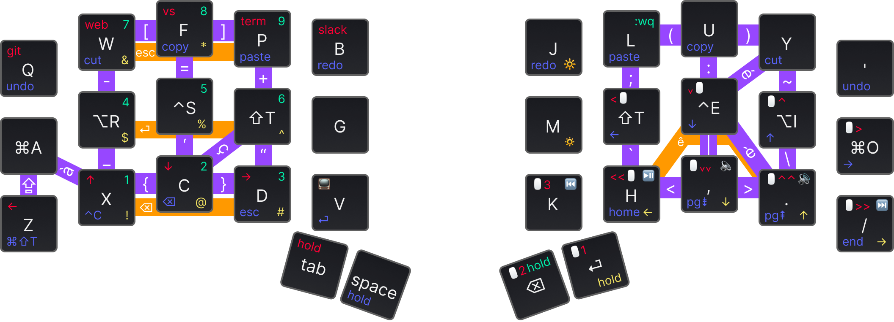

# xavv1 – 34 keys hybrid Layout & Combo

## Keymap

_Figma layouts made thanks to [@madhanparthasar](https://www.figma.com/@madhanparthasar)'s [Ortholinear Keyboard Keybinding Layout Tool
](https://www.figma.com/community/file/1283154322826272613)_ 🙌



## Origins

This layout is organic and keeps evolving based on:

- real needs: reduce hand gestures, reduce frequently used keystrokes, etc.
- exploration need: custom keebs offer a brand new experience and I love to explore what is possible out there
 

It's not a surprise that this keymap is a hybrid. It was inspired by 2 opposite approaches:

- [Miryoku](https://github.com/manna-harbour/miryoku) – a full-layer COLMAK-DH keymap, that has excellent [principles](https://github.com/manna-harbour/miryoku/tree/master/docs/reference#general-principles):
  - Use layers instead of reaching.
  - Use both hands instead of contortions.
  - Use the home positions as much as possible.
  - Make full use of the thumbs.
  - Avoid unnecessary complications.
- [Kombol](https://github.com/skychil/kombol) – a combo-optimized keymapping. This extends Miryoku and removes some confusion for keys like `[]`, `{}`, `()`, `-=+`, `' "`, `; :`, ... that I had some hard time mastering with Miryoku.

The QMK code is inspired by the [aurora sweep_keymap from flinguenheld](https://github.com/flinguenheld/sweep_keymap) and the default Cantor keymap.

My code is probably NOT clean, I would NOT recommend using it as a starting point to create a brand new keymap.
But you can explore some features and take the pieces you want.

### Tap Dance

#### Thumbs layer switches

The default QMK behavior was not working for me. Imagine you have a number layer, activated with a [Momentary layer switch "MO(layer)"](https://docs.qmk.fm/#/keycodes?id=layer-switching). Now you also have the "backspace" key on that same key.

- Keep the key down, it momentarily switches to the layer
- Release the key, it comes back to the root layer
- Tap the key, it triggers a backspace

This sounds all good. But now, you need to type a phone number quickly.
Snap! You made a mistake with the numbers, let's lightning-fast `backspace` it and retype. Then reselect the layer.
That's where QMK implementation of the `MO` switch was not OK to me. When you reselect the layer, if you are under the `TAPPING_TERM` (200ms) time since you tapped `backspace`, it will tap `backspace` again, even when stay pressed on the key; and the layer would no activate either.

This was quite frustrating to me. Especially that my ErgoDox EZ nailed this part.
To solve this, I implemented the `features/tap_dance.c` part.

### Arbitrations

The backspace key cannot be pressed long to remove a chain of characters until it's released.
I'm very happy about this "limitation" because it forced me to learn better ways to remove text:

- use `CMD + backspace` to delete characters until the start of the line
- use `OPT + backspace` to delete characters until the start of the word
- use `SHIFT + arrows` to select the part of the text to remove (arrows allow for being triggered many times when kept pressed). This allows me to ensure the expected characters are selected before I press the backspace key – it's easier to fix a bad text selection than to `undo` a chain backspace with precision (generally the whole chain removal will be undone when you expect to only undo 1 or 2 characters)

## Install

Add this repos as a git submodule inside the `qmk_firmware/keyboards/cantor/keymaps` folder:

```shell
cd qmk_firmware/keyboards/cantor/keymaps
git submodule add https://github.com/malparty/xavv1-remix.git
cd ../../../
make git-submodule
cd keyboards/cantor/keymaps/xavv1-remix
```

## Compile and flash

Navigate into the keymap folder `qmk_firmware/keyboards/cantor/keymaps/xavv1-remix`.

Compile with `qmk compile` and flash both sides with `qmk flash`.
